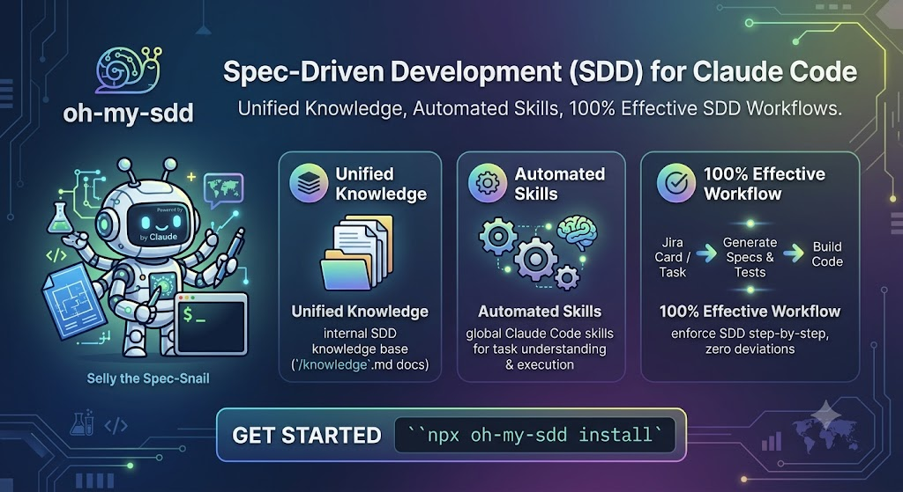

# oh-my-sdd



A set of global Claude Code skills that rigorously enforce **Spec-Driven Development (SDD)**: before implementing any task, Claude analyzes the project, generates `constitution.md` → `spec.md` → `plan.md` → `tasks.md`, with mandatory human validation before implementation is allowed to start.

📖 **Documentation:** [English](https://slpascoal.github.io/oh-my-sdd/) · [Português](https://slpascoal.github.io/oh-my-sdd/pt/)

## Installation

```bash
npx oh-my-sdd install
```

This installs the 6 skills globally in `~/.claude/skills/`, available in any project opened in Claude Code — installation does not depend on the directory the command is run from.

## Architecture

An orchestrator skill (`oh-my-sdd`) activates, in sequence, 5 specialized skills — one per SDD phase:

| Skill | Responsibility |
|---|---|
| `oh-my-sdd` | Orchestrates the flow, identifies the input (free text or Jira) and activates the others in order |
| `oh-my-sdd-constitution` | Founds the constitution on what the project already documents and practices: scans `CLAUDE.md`, `AGENTS.md`, `.cursor/rules/`, `CONTRIBUTING.md`, lint configs and CI workflows first (every rule traced to its source, conflicts asked — never silently resolved), then falls back to code analysis, asking the user only what remains |
| `oh-my-sdd-specify` | Generates `spec.md` in EARS/GEARS — **human checkpoint #1** |
| `oh-my-sdd-plan` | Translates the validated spec into technical decisions (`plan.md`) |
| `oh-my-sdd-tasks` | Breaks the plan into atomic tasks (`tasks.md`) — **human checkpoint #2** |
| `oh-my-sdd-implement` | Implements task by task, only after both checkpoints are confirmed |

Each installed skill is self-contained: it gets its own copy of [`knowledge/`](./knowledge), the SDD knowledge base (maturity levels, EARS/GEARS syntax, artifact hierarchy, practical examples) that underpins how each phase generates its document.

## Usage

Once installed, the flow is automatically discovered by Claude Code whenever a task should be specified before being implemented. It can also be invoked directly:

```
/oh-my-sdd "add a logout endpoint that invalidates the refresh token"
/oh-my-sdd PROJ-123
/oh-my-sdd https://company.atlassian.net/browse/PROJ-123
```

## Other commands

```bash
npx oh-my-sdd status      # shows which of the 6 skills are installed and whether any file was manually modified
npx oh-my-sdd uninstall   # removes the 6 skills from ~/.claude/skills/
```

## Adaptive scale

Not every task deserves the full pipeline. Before running any sub-skill, the orchestrator classifies the task and routes it:

- **QUICK** — inline mini-spec + single confirmation, straight to implementation (typos, isolated bug fixes)
- **SMALL** — condensed spec + tasks with embedded decisions, both human checkpoints kept
- **MEDIUM / LARGE** — full pipeline, unchanged

Classification + reason print in one line and are recorded in `.oh-my-sdd/runtime/scale.json` (gitignored). The model may only reclassify **upward**; only you can force the scale down. See [Quick Start](https://slpascoal.github.io/oh-my-sdd/getting-started/quick-start/) for the full criteria table.

## Sensors & evidence

Implementation only counts as done when real commands prove it. Sensors are per-stack auto-detected checks (tests, typecheck, lint — Node, Python, Go, Rust, Java) stored in `.oh-my-sdd/config/sensors.json`:

```bash
npx oh-my-sdd sensor init --yes        # detect the stack and write the config
npx oh-my-sdd sensor run <slug>        # run sensors, write evidence, block on required failure
npx oh-my-sdd sensor status <slug>     # evidence table with fingerprint validity
```

Before its final report, `oh-my-sdd-implement` runs the sensors and blocks on any required failure. Acceptance criteria are reported as met only with evidence (passing sensor or manual check note); otherwise they stay explicitly **pending verification**. Evidence lives in `.oh-my-sdd/runtime/` (gitignored) and expires when tracked code changes. See the [CLI reference](https://slpascoal.github.io/oh-my-sdd/cli/) for details.

## Knowledge base

The [`knowledge/`](./knowledge) folder documents the SDD fundamentals used by every skill: maturity levels (spec-first, spec-anchored, spec-as-source), best practices for writing specs and constitutions, EARS/GEARS syntax, and complete practical examples.

## License

MIT
