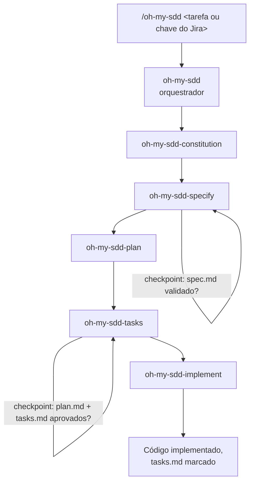

# Visão Geral da Arquitetura

O `oh-my-sdd` não é uma skill monolítica — é um **orquestrador** que ativa **5 skills especializadas**, uma por fase do Spec-Driven Development. Cada skill é responsável por exatamente um artefato e, quando relevante, por seu próprio checkpoint humano.

## O fluxo

## Responsabilidades em resumo

| Skill | Lê | Escreve | Checkpoint |
|---|---|---|---|
| `oh-my-sdd` | input do usuário / Jira | — | — |
| `oh-my-sdd-constitution` | código e config do projeto | `.oh-my-sdd/constitution.md` | nenhum (analisa primeiro, pergunta só se necessário) |
| `oh-my-sdd-specify` | `constitution.md` | `.oh-my-sdd/specs/<slug>/spec.md` | **#1** — spec precisa ser validado |
| `oh-my-sdd-plan` | `spec.md`, `constitution.md` | `.oh-my-sdd/specs/<slug>/plan.md` | nenhum |
| `oh-my-sdd-tasks` | `plan.md`, `spec.md` | `.oh-my-sdd/specs/<slug>/tasks.md` | **#2** — plan + tasks precisam ser aprovados |
| `oh-my-sdd-implement` | `tasks.md`, `spec.md`, `constitution.md` | código-fonte do projeto | nenhum (implementação só começa depois do checkpoint #2) |

## Princípios de design

- **O orquestrador nunca gera artefatos diretamente.** Ele só sequencia as 5 skills e espera o sinal de cada uma antes de avançar.
- **Os checkpoints pertencem à skill responsável pelo artefato.** A `oh-my-sdd-specify` não devolve o controle até você validar o `spec.md`; a `oh-my-sdd-tasks` não devolve o controle até você aprovar `plan.md` + `tasks.md`.
- **Toda skill é autocontida.** Cada uma traz sua própria cópia da [base de conhecimento sobre SDD](../concepts/what-is-sdd.md), então nenhuma skill depende de um caminho relativo para dentro da pasta de uma skill-irmã.
- **A constitution é inferida, não entrevistada.** A `oh-my-sdd-constitution` lê seu código e config reais primeiro; só pergunta o que genuinamente não pode ser inferido.

Para o comportamento exato de cada skill, veja a [Referência de Skills](skills.md).
